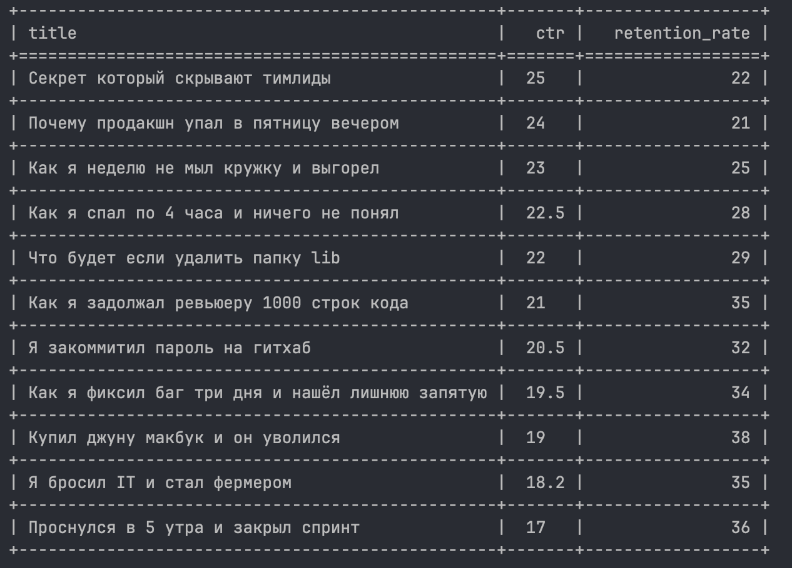

# CSV Parser CLI

CLI-приложение для обработки CSV-файлов с метриками видео на YouTube.

Формирует отчёты по заданным условиям.
Реализован отчёт "clickbait" — видео с высоким CTR и низким удержанием.

## Запуск приложения

```bash
poetry run python main.py --files stats1.csv stats2.csv --report clickbait
```

## Запуск тестов

```bash
poetry run pytest
```

## Пример вывода



## Параметры

- `--files` — список CSV-файлов
- `--report` — тип отчёта ("clickbait")

## Обработка ошибок

- Если файл не найден — выводится сообщение об ошибке
- Если указан неизвестный отчёт — выводится сообщение об ошибке

## Используемые технологии

- Python
- argparse
- csv
- tabulate
- pytest

## Зависимости

Для управления зависимостями используется Poetry.